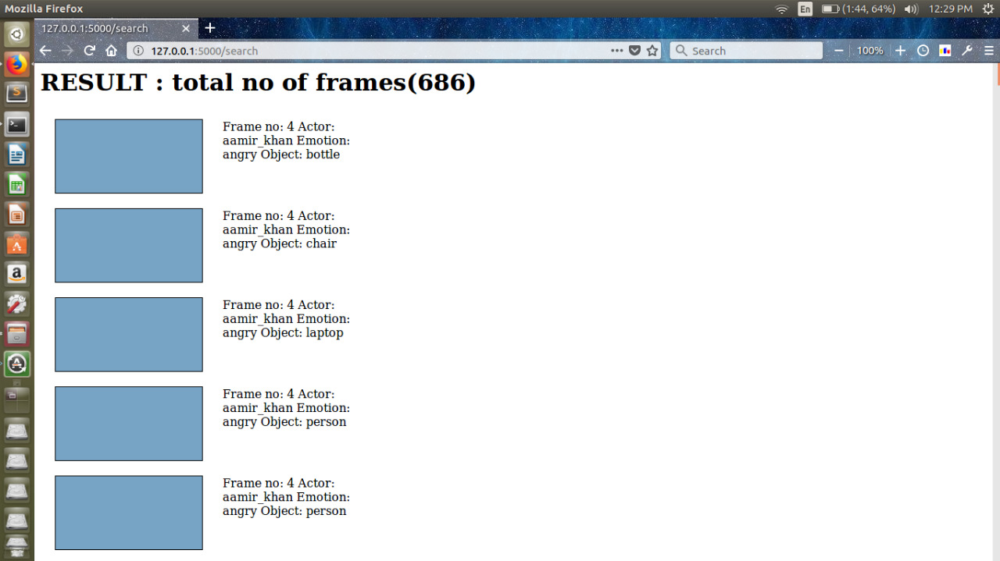

# Face-Recognition-and-Emotion-Analysis

**Emotion Object** can be found [here](https://github.com/oarriaga/face_classification).

**Face Recognition** can be found [here](https://github.com/ageitgey/face_recognition).

**Object Recognition** can be found [here](https://github.com/devicehive/devicehive-video-analysis).

Large files to be downloaded from [here](https://drive.google.com/drive/folders/1-FDO9LFhEwWAS5pStcRACW9gYuXlB0jA).

1.) Create a folder in src named 'data' and a folder in data named 'yolo'

2.) Copy the files from the above link in the folder 'yolo'

Structure:
- src
  - data
    - yolo
    - yolo_model.ckpt.data-00000-of-00001
    - yolo_model.ckpt.index
    - yolo_model.ckpt.meta
    - yolo2.names

---

## **`webapp.py`**: Home page of the web application.

### Functionality:

1) ***Browse button***:

- Button to select a video file (of any given format) from the local file system for processing it (creating the metadata).

2) ***Send***:
- After the click of this button, the chosen video files (one or many) are sent for processing ( creating the metadata).
- After processing of the video, the metadata is created is stored in the database (named as ‘DB’). 
- This database has two tables namely:

1) **‘Actor’**

This table stores:

	1. Frame no
	2. Actor name
	3. Emotion Name
	4. Emotion Confidence
	5. Thumbnail
	6. Co-ordinates

2) **‘Object’**

This table stores:
	
	1. Frame no
	2. Object name
	3. Object Confidence


3) ***Search***:

- Used for querying over a particular video file. 
- A query may consists of any or all of the possible combination from an actor name, object name and emotion name.
- A query is performed on the database to retrieve all the frames whose data matches with the given search query. 
- The results along with the frames and their corresponding details are displayed on a separate page as shown in the image.

4) ***Clear***

- Clears the text query from the search box.


## Workflow for the processing of videos, creation of metadata, storage in the database:
    
### 1) ***upload function*** in **webapp.py**:

- Function that enables the user to select a video from his local machine (any format).
- The path of this video is stored in the ‘*destination*’ variable.
- This function calls another python file - > '*video_emotion_color_demo.py*'

- A variable ‘*comm*’ is created which consists of the call to the python file ‘video_emotion_color_demo.py’ and its argument, ‘destination’.

> comm="python video_emotion_color_demo.py '"+destination+"'"

- A subprocess class isthen used to perform the required call.

### 2) ***search function*** in **webapp.py**:

- The objective of this function is to perform a query on the database to retrieve all the frames whose data matches with the given search query. 
- The first word in the search query corresponds to the Actor name, second one corresponds to the emotion and the third one corresponds to the object that the users wants in the frames. 
- We have the updated database classes - Actor, Object. 
- The full query is taken in a variable ‘Query’. 
- It is then split into words which is of a specific format as mentioned above. 
 
 ```
    Query[0] - Actor name
    Query[1] - Emotion name
    Query[2] - Object name
    
```

- ‘***resultt***’ is a variable which stores all the required data entries after querying the database according to the input provided. 

- If the input is only an Actor name then result is stored with all the entries having actorname as the given name.

```
resultt=(db.session.query(Actor,Object).filter(Actor.actorname==Query[0]).all())

```

- If the input contains Actor name with a specific emotion then the result is stored by querying the database with 2 filters one for the actor name and one for the emotion that has been entered.

```
resultt=(db.session.query(Actor,Object).filter(Actor.actorname==Query[0]).filter(Actor.emotionname==Query[1]).all())    
```

- If the input contains Actor name, emotion and an object, then the result is stored with all the details of frames which contain Actor name, emotion and object with one more filter that ensures that the frames from the two classes are the same. Following is the query used:

```
resultt = (db.session.query(Actor,Object).filter(Actor.actorname==Query[0]).filter(Actor.emotionname==Query[1]).filter(Object.objectname==Query[2]).filter(Actor.frameno==Object.frameno).all()) 
```
The result variable along with its length is rendered to another html page - “input.html”.
In this page, for every result entry, Frame number, Actor name,  Emotion and Object recognized is shown along with a static image.

### 3) ***process function*** in **video_emotion_color_demo.py**:

- This function takes parameter ‘paath’ which is the address of the video file. 
- Here the video file is processed frame by frame for the different class labels(frame_no,actorname, emotion name, emotion probability, image_file(thumbnail of the frame),coordinates of the face detected) and a table named ‘Actor’ is created which contains all this data.

**Following steps are performed to achieve this:**

a) The different sections within the frame that consists of a face are stored in variable ‘faces’. These are then traversed in a for loop and the values for actor_name, emotion_name,emotion_probability,coordinates of the face are obtained for every particular face of a frame.

b) A separate row is created for each face and these values are added in the respective columns of the table ‘Actor’.
Along with this, a rectangular bounding box is created around each face of all the frames for display. Different colors are used for the boxes for different emotions. The emotion name is displayed as well at one of the corners of the bounding box.
At the end, this function gives a call to the ‘eval.py’ file. It does so by creating the variable command and appending path to it. (command="python eval.py --video='"+paath+"'")
Then the subprocess class is used to call the python file.

### 4) ***evaluate function*** in **eval.py**:

Here the video file is processed frame by frame for the different class labels(frame_no,objectname, object confidence) and a table named ‘Object’ is created which contains all this data.

**Following steps are performed to achieve this:**

a) The different objects detected in a particular single frame are stored in a list ‘predictions’. This list is iterated for all the objects in the frame and the values for object name, object confidence are obtained by using the object detection model.

b) A separate row is created in the table ‘Object’ and all this data is stored in the table.


In this way, the complete video is traversed twice, one for obtaining the actor name and emotion name and the other for obtaining the object name. This has been done because there must be frames in the video that contain objects but does not contain any faces. The same frame in two different tables ‘Actor’ & ‘Object’ are joined together using the attribute ‘frame_no’.

### 5) **train_on_actors.py**:

- This is the Face recognition model training utility program.

- Go to the path -   src → knn_examples → train
- Create a folder with the name of the Class Name and paste the new training images in that folder. 
- - If the Class does not exist then make a new directory with the name of the Class and paste the training images in that folder.
- - Now run the python file train_on_actors.py and the training will start and the details will be shown on the CMD. 
- The new model file can be changing the name in the python script. 


### Current Scenario:

After the search query is run, we get the results in the form of frame numbers. These frame numbers are to be processed to get the respective start and the end time. The search input should only be any of the below given forms: 

	1.Actor_name
	2.Actor_name <space> Emotion
	3.Actor_name <space> Emotion <space> Object_name 
	
- Separate Database files are maintained to store the information of all the frames.
- After the training face recognition models, the corresponding models are saved and can be used as and when needed. 
- The results page contains the details of every result frame like face, its emotion and the objects detected.
- Every result frame has a default image thumbnail which needs to be dynamic according to  the frames present. 


### Areas that need assistance:

1.) *UI/UX* - Integrating a video player that will play video after any individual result is selected. Before that, instead of all the contiguous frame numbers, just the starting and the ending time of a contiguous set of frame numbers should be found. Thus each contiguous set of frame numbers will correspond to a result video. 

2.) Each result thumbnail is a default image which should be dynamic according to the result frames.

### Screenshots of the UI:

1. Homepage


2. Browse and upload videos


3. Result Page


